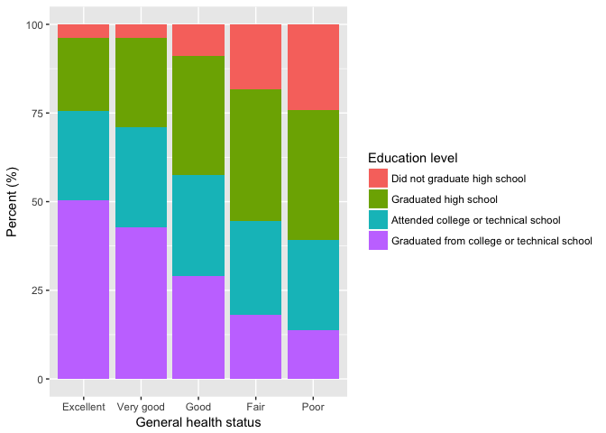

Exploring the BRFSS data
================

Setup
-----

### Load packages

``` r
library(ggplot2)
library(dplyr)
```

### Load data

``` r
load("brfss2013.RData")
```

------------------------------------------------------------------------

Part 1: Data
------------

Our sample is the non-institutionalized adult population aged 18 years or order who reside in the United States (all 50 states, the District of Columbia, Puerto Rico, and Guam). The data is collected by conducting a telephone survey in both landline and cellphone frames. Since the study is observational and random assignment is not used, the findings cannot be used to establish causal relationships. The sample is randomly selected for each state and each of two survey frames, but we have several things to verify in our sample-collecting method to generalize the results to the population; for example, whether the proper amount of samples was surveyed for every state compared to total observations, and whether the ratio of the landline- to the cellphone survey is well determined, which might be closely related to the distribution of age in our sample.

------------------------------------------------------------------------

Part 2: Research questions
--------------------------

**Research quesion 1:**

I'm intested in what percentage of adults have a poor general health status for each state. I'd like to compare the percentage among all 53 participating states in the US and find the list of the states having comparably high values.

This could be a useful source for the US to figure out how to improve a general health status of aduls in the US.

**Research quesion 2:**

I chose three factors in our data which are if they have any health coverage, a completed education level, and an income level. I'd like to explore how each of these three factors is related to a general health status of adults in the US.

In this survey we cannot give any causality on our results, but this could be a good source to set up other experiments which try to understand main factors for poor general health.

**Research quesion 3:**

We've found the list of 19 states which have a relatively high percentage of a poor general health status from the result of question 1, and the analysis in question 2 says that an income level might be closely related to a general health status. These findings lead me to be curious, if all 53 states are divided into two groups by the 19 states and the rest, then what are the distributions of income levels like in these two groups?

Note that I'm going to create a new variable named "poor\_percent" assigning a group to each sample.

------------------------------------------------------------------------

Part 3: Exploratory data analysis
---------------------------------

**Research quesion 1:**

In the first question, we'll find the percent of a poor general health status for each state. Two variables "X\_state" and "genhlth" stand for a state and a general health status, respectively, and the following is their structures.

``` r
brfss2013 %>%
  select(X_state, genhlth) %>%
  str()
```

    ## 'data.frame':    491775 obs. of  2 variables:
    ##  $ X_state: Factor w/ 55 levels "0","Alabama",..: 2 2 2 2 2 2 2 2 2 2 ...
    ##  $ genhlth: Factor w/ 5 levels "Excellent","Very good",..: 4 3 3 2 3 2 4 3 1 3 ...

Both are categorical data. Here is a summary for "X\_state" with frequency and percent. We can see 2 people answered "0" and "80" for their states, and we'll filter them out later.

``` r
total_obs <- dim(brfss2013)[1]

brfss2013 %>%
  group_by(X_state) %>%
  summarise(count = n(), percent = round(count/total_obs*100, 2)) %>%
  arrange(desc(-count))
```

    ## # A tibble: 55 x 3
    ##                 X_state count percent
    ##                  <fctr> <int>   <dbl>
    ##  1                    0     1    0.00
    ##  2                   80     1    0.00
    ##  3                 Guam  1897    0.39
    ##  4              Arizona  4253    0.86
    ##  5               Alaska  4578    0.93
    ##  6 District of Columbia  4931    1.00
    ##  7               Nevada  5101    1.04
    ##  8             Delaware  5206    1.06
    ##  9            Louisiana  5215    1.06
    ## 10             Arkansas  5268    1.07
    ## # ... with 45 more rows

We can define a new variable named "num\_genhlth" that assigns a numerical values (1-5) to each level of general health status (Poor-Excellent), and here is a summary for "genhlth" and "num\_genhlth" with frequency and percent.

``` r
brfss2013 <- brfss2013 %>%
  mutate(num_genhlth = 6 - as.numeric(genhlth))
brfss2013 %>%
  group_by(genhlth, num_genhlth) %>%
  summarise(count = n(), percent = round(count/total_obs*100,2))
```

    ## # A tibble: 6 x 4
    ## # Groups:   genhlth [?]
    ##     genhlth num_genhlth  count percent
    ##      <fctr>       <dbl>  <int>   <dbl>
    ## 1 Excellent           5  85482   17.38
    ## 2 Very good           4 159076   32.35
    ## 3      Good           3 150555   30.61
    ## 4      Fair           2  66726   13.57
    ## 5      Poor           1  27951    5.68
    ## 6        NA          NA   1985    0.40

Selecting two variables that we are using, and getting rid of "0" and "80" entries in "X\_state" and "NA" entries in "num\_genhlth," we can make a new data set named "Q1\_brfss2013." For every state, we can find "percent\_gh1", a percent of people having a poor general health status, along with some statistics (mean, median, standard deviation, IQR) of the status. We'll only see the states whose "percent\_gh1" are higher than 5.68% which is the percent of a poor general helath status in the entire sample.

``` r
Q1_brfss2013 <- brfss2013 %>%
  select(X_state, num_genhlth) %>%
  filter(!(X_state %in% c('0', '80')) & !is.na(num_genhlth)) 

Q1_brfss2013 <-Q1_brfss2013 %>%
  group_by(X_state) %>%
  summarise(mean = round(mean(num_genhlth),2), median = median(num_genhlth), sd = round(sd(num_genhlth),2), IQR = IQR(num_genhlth), percent_gh1 = round(sum(num_genhlth==1)/n()*100,2)) %>%
  arrange(desc(percent_gh1)) %>%
  filter(percent_gh1>5.68)

Q1_brfss2013
```

    ## # A tibble: 19 x 6
    ##           X_state  mean median    sd   IQR percent_gh1
    ##            <fctr> <dbl>  <dbl> <dbl> <dbl>       <dbl>
    ##  1      Tennessee  3.17      3  1.18     2       11.06
    ##  2    Mississippi  3.12      3  1.17     2       10.72
    ##  3       Arkansas  3.14      3  1.15     2       10.15
    ##  4  West Virginia  3.15      3  1.14     2        9.53
    ##  5        Alabama  3.14      3  1.15     2        9.42
    ##  6       Kentucky  3.17      3  1.13     2        9.15
    ##  7      Louisiana  3.17      3  1.16     2        8.93
    ##  8       Oklahoma  3.27      3  1.13     1        8.31
    ##  9        Florida  3.31      3  1.15     1        7.89
    ## 10 North Carolina  3.33      3  1.14     1        7.33
    ## 11 South Carolina  3.34      3  1.13     1        7.09
    ## 12       Missouri  3.30      3  1.11     1        6.88
    ## 13          Texas  3.31      3  1.12     1        6.83
    ## 14        Indiana  3.33      3  1.09     1        6.73
    ## 15     New Mexico  3.34      3  1.13     1        6.62
    ## 16        Arizona  3.39      3  1.13     1        6.60
    ## 17        Georgia  3.35      3  1.12     1        6.39
    ## 18           Ohio  3.37      3  1.10     1        5.73
    ## 19        Montana  3.47      4  1.10     1        5.70

We have the list of 19 states having comparably high percentage of poor general health status and save it as a value of "High\_gh1\_states." Using the above summary, we make a bar plot over the 19 states in the below. Comparing with 5.68%, we can see that Tennessee, Mississippi, and Arkansas have particularly very high percentage of people having a poor general health.

``` r
High_gh1_states <- Q1_brfss2013$X_state

ggplot(data=Q1_brfss2013, aes(x=reorder(X_state, percent_gh1), y=percent_gh1)) + geom_bar(stat="identity") + coord_flip() + geom_text(aes(label=percent_gh1), hjust=-.1, size=2.8) + labs(x="", y="Rate of poor general health (%)") 
```


**Research quesion 2:**

In the second question, we're interested in three factors; if they have any health care coverage, completed education level, and income level. We'll explore the relationships between a general health status and each of these three factors. To do this, first we should familiarise ourselves with the variables "hlthpln1," "X\_educag," and "X\_incomg." Here are the variables' structures followed by their summaries with frequency and percent.

``` r
brfss2013 %>%
  select(hlthpln1, X_educag, X_incomg) %>%
  str()
```

    ## 'data.frame':    491775 obs. of  3 variables:
    ##  $ hlthpln1: Factor w/ 2 levels "Yes","No": 1 1 1 1 1 1 1 1 1 1 ...
    ##  $ X_educag: Factor w/ 4 levels "Did not graduate high school",..: 4 3 4 2 4 4 2 3 4 2 ...
    ##  $ X_incomg: Factor w/ 5 levels "Less than $15,000",..: 5 5 5 5 4 5 NA 4 5 2 ...

``` r
brfss2013 %>%
  group_by(hlthpln1) %>%
  summarise(count=n(), percent=round(count/total_obs*100, 2))
```

    ## # A tibble: 3 x 3
    ##   hlthpln1  count percent
    ##     <fctr>  <int>   <dbl>
    ## 1      Yes 434571   88.37
    ## 2       No  55300   11.24
    ## 3       NA   1904    0.39

``` r
brfss2013 %>%
  group_by(X_educag) %>%
  summarise(count=n(), percent=round(count/total_obs*100, 2))
```

    ## # A tibble: 5 x 3
    ##                                     X_educag  count percent
    ##                                       <fctr>  <int>   <dbl>
    ## 1               Did not graduate high school  42213    8.58
    ## 2                      Graduated high school 142968   29.07
    ## 3       Attended college or technical school 134196   27.29
    ## 4 Graduated from college or technical school 170118   34.59
    ## 5                                         NA   2280    0.46

``` r
brfss2013 %>%
  group_by(X_incomg) %>%
  summarise(count=n(), percent=round(count/total_obs*100, 2))
```

    ## # A tibble: 6 x 3
    ##                       X_incomg  count percent
    ##                         <fctr>  <int>   <dbl>
    ## 1            Less than $15,000  52235   10.62
    ## 2 $15,000 to less than $25,000  76606   15.58
    ## 3 $25,000 to less than $35,000  48867    9.94
    ## 4 $35,000 to less than $50,000  61508   12.51
    ## 5              $50,000 or more 181131   36.83
    ## 6                           NA  71428   14.52

These are all categorical data. So we use bar plots to show their relations with a general health level. The first factor to use is if they have a health care coverage. After getting rid of "NA" entries in both "genhlth" and "hlthpln1," we calculate the rate of having no health care coverage for each category of general health status.

``` r
Q2_hcover_brfss2013 <- brfss2013 %>%
  filter(!is.na(genhlth), !is.na(hlthpln1)) %>%
  group_by(genhlth) %>%
  summarise(percent_no_coverage = round(sum(hlthpln1=="No")/n()*100,2))  
Q2_hcover_brfss2013
```

    ## # A tibble: 5 x 2
    ##     genhlth percent_no_coverage
    ##      <fctr>               <dbl>
    ## 1 Excellent                9.54
    ## 2 Very good                8.94
    ## 3      Good               13.10
    ## 4      Fair               14.44
    ## 5      Poor               12.40

We make a plot showing the above result. As we can see, the percent of no coverage is higher in Good, Fair, and Poor levels than in Excellent and Very good levels, and Fair level has the highest percent.

``` r
ggplot(data=Q2_hcover_brfss2013, aes(x=genhlth, y=percent_no_coverage)) + geom_bar(stat="identity") + labs(title=" Rate of having any health care coverage", x="General health status", y="Percent (%)") + geom_text(aes(label=percent_no_coverage), vjust=-.8, size=3)
```


We consider the second factor, a completed education level. As we did in the previous step, filter out "NA" entries from data, and find the number of total observations for each category of general health status. Grouping each general health category by education level, we can calculate a percent of every education level in each general health level. We put the percent as a variable named "percent\_edu\_gh."

``` r
Q2_edu_brfss2013 <- brfss2013 %>%
  filter(!is.na(genhlth), !is.na(X_educag)) %>%
  select(genhlth, X_educag) %>%
  group_by(genhlth) %>%
  mutate(total_genhlth=n())

Q2_edu_brfss2013 <- Q2_edu_brfss2013 %>%
  group_by(genhlth, X_educag) %>%
  mutate(percent_edu_gh = round(n()/total_genhlth*100,2)) 

Q2_edu_brfss2013 <- Q2_edu_brfss2013 %>%
  group_by(genhlth, X_educag, percent_edu_gh) %>%
  summarise()
 
Q2_edu_brfss2013
```

    ## # A tibble: 20 x 3
    ## # Groups:   genhlth, X_educag [?]
    ##      genhlth                                   X_educag percent_edu_gh
    ##       <fctr>                                     <fctr>          <dbl>
    ##  1 Excellent               Did not graduate high school           3.81
    ##  2 Excellent                      Graduated high school          20.64
    ##  3 Excellent       Attended college or technical school          25.10
    ##  4 Excellent Graduated from college or technical school          50.46
    ##  5 Very good               Did not graduate high school           3.94
    ##  6 Very good                      Graduated high school          25.12
    ##  7 Very good       Attended college or technical school          28.30
    ##  8 Very good Graduated from college or technical school          42.64
    ##  9      Good               Did not graduate high school           8.99
    ## 10      Good                      Graduated high school          33.51
    ## 11      Good       Attended college or technical school          28.58
    ## 12      Good Graduated from college or technical school          28.91
    ## 13      Fair               Did not graduate high school          18.28
    ## 14      Fair                      Graduated high school          37.07
    ## 15      Fair       Attended college or technical school          26.57
    ## 16      Fair Graduated from college or technical school          18.07
    ## 17      Poor               Did not graduate high school          24.11
    ## 18      Poor                      Graduated high school          36.62
    ## 19      Poor       Attended college or technical school          25.41
    ## 20      Poor Graduated from college or technical school          13.87

By using the above summary, we can make a bar plot showing the distribution of education levels in each general health level. It is easy to see that the ratio of people who didn't attend college or technical school is increasing pretty quickly as a health status is getting worse. On the other hands, the ratio of people graduated from college or technical school is quickly decreasing as health status goes to be poor.

``` r
ggplot(data=Q2_edu_brfss2013, aes(x=genhlth, y=percent_edu_gh, fill=X_educag))+geom_bar(stat="identity") + labs(x="General health status", y="Percent (%)", fill="Education level") 
```



Lastly, we consider income levels of people. Like a previous argument with an education level, we can find the distribution of income levels for each general health status. Also, we can similarly find the summary statistics and a barplot using the variables "genhlth" and "X\_incomg."

``` r
Q2_inc_brfss2013 <- brfss2013 %>%
  filter(!is.na(genhlth), !is.na(X_incomg)) %>%
  select(genhlth, X_incomg) %>%
  group_by(genhlth) %>%
  mutate(total_genhlth=n())

Q2_inc_brfss2013 <- Q2_inc_brfss2013 %>%
  group_by(genhlth, X_incomg) %>%
  mutate(percent_inc_gh = round(n()/total_genhlth*100, 2)) 

Q2_inc_brfss2013 <- Q2_inc_brfss2013 %>%
  group_by(genhlth, X_incomg, percent_inc_gh) %>%
  summarise()

Q2_inc_brfss2013
```

    ## # A tibble: 25 x 3
    ## # Groups:   genhlth, X_incomg [?]
    ##      genhlth                     X_incomg percent_inc_gh
    ##       <fctr>                       <fctr>          <dbl>
    ##  1 Excellent            Less than $15,000           5.99
    ##  2 Excellent $15,000 to less than $25,000          11.14
    ##  3 Excellent $25,000 to less than $35,000           8.78
    ##  4 Excellent $35,000 to less than $50,000          13.43
    ##  5 Excellent              $50,000 or more          60.66
    ##  6 Very good            Less than $15,000           6.18
    ##  7 Very good $15,000 to less than $25,000          13.22
    ##  8 Very good $25,000 to less than $35,000          10.66
    ##  9 Very good $35,000 to less than $50,000          15.67
    ## 10 Very good              $50,000 or more          54.26
    ## # ... with 15 more rows

``` r
ggplot(data=Q2_inc_brfss2013, aes(x=genhlth, y=percent_inc_gh, fill=X_incomg))+geom_bar(stat="identity")+labs(x="General health status", y="Percent (%)", fill="Income level") 
```


As we've possibly guessed, the average of an income level is decreasing as health status goes from Excellent to Poor. Especaiily we can see that the rate of people making less than $25,000 a year is drastically increasing from 17.13% to 68.20% as it goes from Excellent to Poor. So we might say that general health status is closely related with an income level.

**Research quesion 3:**

To answer the question 3, we need to divide our sample into two groups based on their states. "High\_gh1\_states" is the list of 19 states having a percent of a poor general health higher than 5.68%. Given a sample observation, if its state is in "High\_gh1\_states," then the sample belongs to a "High" group, and if not, then it belongs to a "Low" group. For each of these two groups, the distribution of income levels can be obtained. In the below summary, "percent" indicates the percent of a income level in each group. We also a bar plot to compare two distributions of "High" and "Low" groups.

``` r
Q3_brfss2013 <- brfss2013 %>%
  select(X_state, X_incomg) %>%
  filter(!X_state%in%c("0","80"), !is.na(X_incomg)) %>%
  mutate(poor_percent = ifelse(X_state%in%High_gh1_states, "High", "Low")) %>%
  group_by(poor_percent) %>%
  mutate(total_group = n())
Q3_brfss2013 <- Q3_brfss2013 %>%
  group_by(poor_percent, X_incomg) %>%
  mutate(percent=round(n()/total_group*100, 2))

Q3_brfss2013 <- Q3_brfss2013 %>%
  group_by(poor_percent, X_incomg, percent) %>%
  summarise(count=n())
Q3_brfss2013
```

    ## # A tibble: 10 x 4
    ## # Groups:   poor_percent, X_incomg [?]
    ##    poor_percent                     X_incomg percent  count
    ##           <chr>                       <fctr>   <dbl>  <int>
    ##  1         High            Less than $15,000   15.16  22828
    ##  2         High $15,000 to less than $25,000   20.92  31508
    ##  3         High $25,000 to less than $35,000   12.52  18859
    ##  4         High $35,000 to less than $50,000   14.79  22273
    ##  5         High              $50,000 or more   36.61  55132
    ##  6          Low            Less than $15,000   10.90  29407
    ##  7          Low $15,000 to less than $25,000   16.72  45098
    ##  8          Low $25,000 to less than $35,000   11.12  30008
    ##  9          Low $35,000 to less than $50,000   14.55  39235
    ## 10          Low              $50,000 or more   46.71 125999

``` r
ggplot(data=Q3_brfss2013, aes(x=poor_percent, y=percent, fill=X_incomg))+geom_bar(stat="identity")+labs(x="Rate of poor general health", y="Percent (%)", fill="Income level") 
```


Roughly speaking, the overall income level in a "High" group seems to be lower than in a "Low" group. The distribution of income levels for the entire sample was obtained in analysis of Research question 2. For your convenience, here is the distribution; less than $15,000: 10.62%, $15,000 to less than $25,000: 15.58%, $25,000 to less than $35,000: 9.94%, $35,000 to less than $50,000: 12.51%, $50,000 or more: 36.83%, NA: 14.52%. Considering this statistics, "High" group has a considerably high percent, 36.08%, of people whose income is less than $25,000 because only about 26% of total observations are in the category of income less than $25,000.
