Modeling and prediction for movies
================

Setup
-----

### Load packages

``` r
library(ggplot2)
library(dplyr)
library(statsr)
library(GGally)
library(gridExtra)
```

### Load data

``` r
load("movies.Rdata")
```

------------------------------------------------------------------------

Part 1: Data
------------

The random sample of 651 movies with their information was obtained from Rotten Tomatoes and IMDB. We can generalize our results from this data to the population of all movies that are released between 1970 and 2016 and listed on those two movie rating sites. Since our study is observational, we cannot establish causation. We can only discuss the association between predictors and reponse variables.

------------------------------------------------------------------------

Part 2: Research question
-------------------------

I would like to predict an average audience rating for a movie based on its attributes. In our dataset, 32 features are given for every movie, and using them we will contruct a multiple regression model for prediction. We will figure out which attributes of a movie are highly correlated with an audience rating.

------------------------------------------------------------------------

Part 3: Exploratory data analysis
---------------------------------

> Selecting variables

``` r
names(movies)
```

    ##  [1] "title"            "title_type"       "genre"           
    ##  [4] "runtime"          "mpaa_rating"      "studio"          
    ##  [7] "thtr_rel_year"    "thtr_rel_month"   "thtr_rel_day"    
    ## [10] "dvd_rel_year"     "dvd_rel_month"    "dvd_rel_day"     
    ## [13] "imdb_rating"      "imdb_num_votes"   "critics_rating"  
    ## [16] "critics_score"    "audience_rating"  "audience_score"  
    ## [19] "best_pic_nom"     "best_pic_win"     "best_actor_win"  
    ## [22] "best_actress_win" "best_dir_win"     "top200_box"      
    ## [25] "director"         "actor1"           "actor2"          
    ## [28] "actor3"           "actor4"           "actor5"          
    ## [31] "imdb_url"         "rt_url"

As you can see, we have 32 attributes of each movie and some of them are just for infomation purposes; for this reason, we will omit 11 variables, "title", "title\_type", "studio", "director", "actor1-5", "imdb\_url", and "rt\_url." There are 6 variables related to dvd/theater release dates of movies, but including them all may culminate in a complex model. We will consider "thtr\_rel\_year" only.

``` r
# IMDb rating and Critics score
ggplot(movies, aes(x=critics_score, y=imdb_rating)) + geom_point(cex=.8) + geom_smooth(method = "lm", se=FALSE) + theme_minimal() + labs(x="Critics Score", y="IMDb Rating")
```

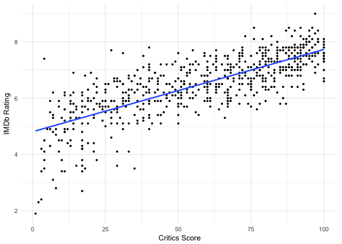

``` r
summary(lm(imdb_rating ~ critics_score, movies))$adj.r.squared
```

    ## [1] 0.5846403

IMDb rating is strongly correlated with Rotten Tomatoes' critics score, so it does make sense to use only one of the ratings for the model. I am choosing the critics score over IMDb rating. Note that we choose critics and audience scores over their rating variables and choose best picture win over nomination.

The variables to use for our linear model are

"genre", "runtime", "mpaa\_rating", "thtr\_rel\_year", "critics\_score", "best\_pic\_win", "best\_actor\_win", "best\_actress\_win", "best\_dir\_win", "top200\_box", and "audience\_score."

> Exploring each attribute

#### 1. Genre

``` r
movies %>%
  group_by(genre) %>%
  summarise(count = n())
```

    ## # A tibble: 11 x 2
    ##                        genre count
    ##                       <fctr> <int>
    ##  1        Action & Adventure    65
    ##  2                 Animation     9
    ##  3 Art House & International    14
    ##  4                    Comedy    87
    ##  5               Documentary    52
    ##  6                     Drama   305
    ##  7                    Horror    23
    ##  8 Musical & Performing Arts    12
    ##  9        Mystery & Suspense    59
    ## 10                     Other    16
    ## 11 Science Fiction & Fantasy     9

``` r
# Delete "Other" genre
movies_ft <- movies %>%
  filter(genre!="Other")
```

``` r
# Distribution of audience scores for each genre of movies
ggplot(movies_ft, aes(x=genre, y=audience_score, fill=genre)) + geom_boxplot() + scale_x_discrete(labels = c("Action","Animat","Art H","Comedy","Docu","Drama","Horror","Musical","Mystery","SciFi")) + labs(x="Genre",y="Audience scores") + ylim(0, 100) 
```

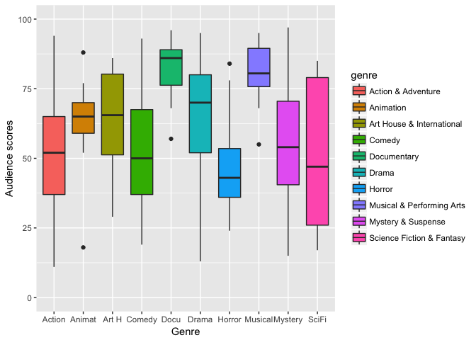

We can observe that distributions of audience score obviously varies depending on genre of the movies.

#### 2. Runtime

``` r
# delete missing data
movies_ft <- movies_ft %>%
  filter(!is.na(runtime))
```

``` r
ggplot(data=movies_ft, aes(x=runtime)) +  geom_histogram(aes(y =..density..), binwidth=5, col="red", fill="white") + geom_density(col=3) + labs(x="Runtime", y="", title="Distribution of Runtime") + theme_minimal()
```

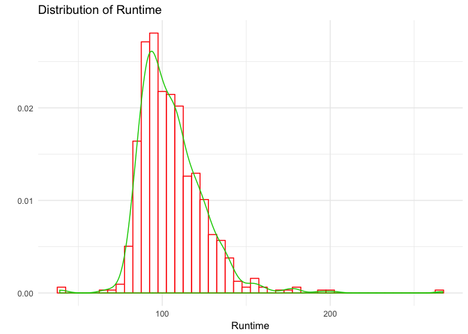

``` r
# runtime vs. audience score 
ggplot(movies_ft, aes(x=runtime, y=audience_score)) + geom_point(cex=1) + geom_smooth(method = "lm", se = FALSE) + labs(x="Audience score", y="Runtime") + theme_minimal()
```

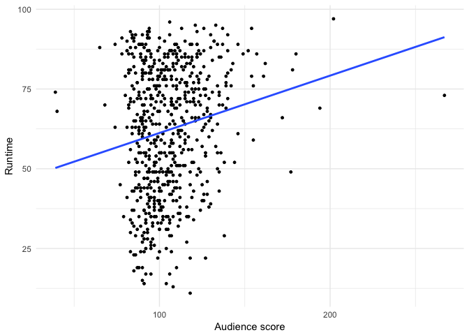

``` r
# Correlation of audience score and runtime.
movies_ft %>%
  summarise(cor(audience_score, runtime))
```

    ## # A tibble: 1 x 1
    ##   `cor(audience_score, runtime)`
    ##                            <dbl>
    ## 1                      0.1727374

#### 3. MPAA film rating

(All age admitted) G &lt; PG &lt; PG-13 &lt; R &lt; NC-17 (Adults only)

``` r
movies_ft %>%
  group_by(mpaa_rating) %>%
  summarize(n=n())
```

    ## # A tibble: 6 x 2
    ##   mpaa_rating     n
    ##        <fctr> <int>
    ## 1           G    19
    ## 2       NC-17     2
    ## 3          PG   111
    ## 4       PG-13   131
    ## 5           R   323
    ## 6     Unrated    48

``` r
# Distribution of audience score for each MPAA rating category
ggplot(movies_ft, aes(x=mpaa_rating, y=audience_score, fill=mpaa_rating)) + geom_boxplot() + labs(x="Audience score", y="MPAA film ratings",  fill="Rating") 
```

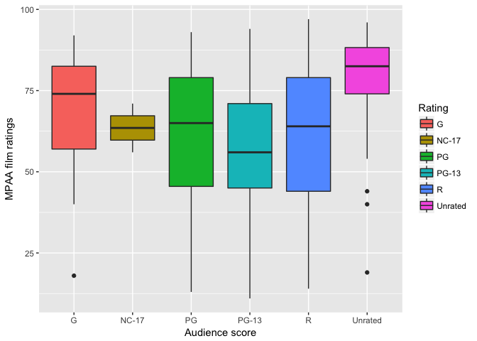

#### 4. Theater release year

``` r
# Divide release year into 5 groups, 1970s - 2010s, and remove missing data
movies_ft <- movies_ft %>%
  mutate(tr_year = ifelse(thtr_rel_year<1980, "1970s", ifelse(thtr_rel_year<1990, "1980s", ifelse(thtr_rel_year<2000, "1990s", ifelse(thtr_rel_year<2010,"2000s", "2010s")))))  %>%
  filter(!is.na(thtr_rel_year))
```

``` r
# Distribution of audience score for each group of release year
ggplot(movies_ft, aes(x=tr_year, y=audience_score, fill=tr_year)) + geom_boxplot() + labs(x="Theater Release Year", y="Audience Score", fill="Year") + ylim(0,100)
```

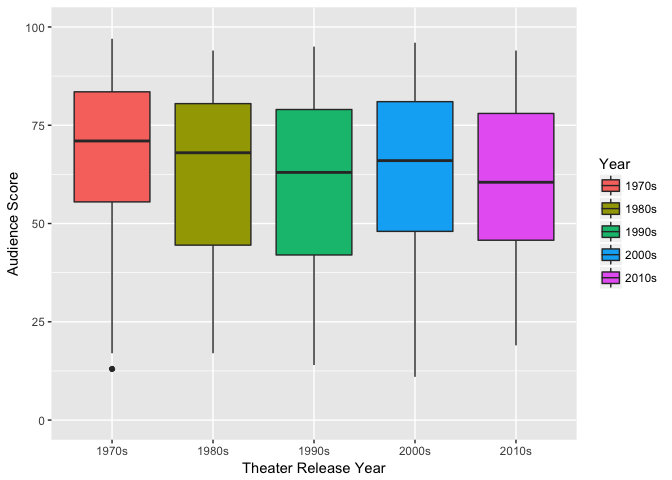

#### 5. Critics score

``` r
ggplot(data=movies_ft, aes(x=critics_score)) +  geom_histogram(aes(y =..density..), breaks=seq(0,100, by=5) , col="red", fill="white") + geom_density(col=3) + labs(x="Critics Score", y="", title="Distribution of Critics Score") + theme_minimal()
```

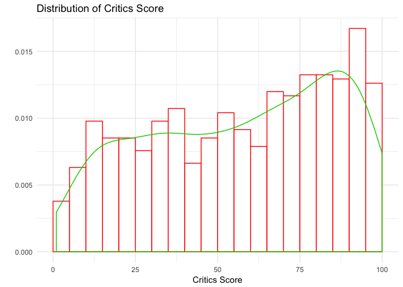

``` r
# critics score vs. audience score
ggplot(movies_ft, aes(x=critics_score, y=audience_score)) + geom_point(cex=1) + geom_smooth(method = "lm", se = FALSE) + xlim(0,100) + labs(x="Critics Score", y="Audience Score") + theme_minimal()
```

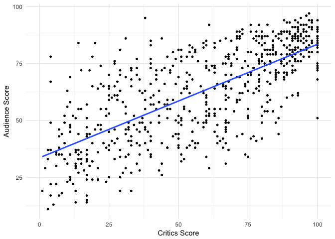

``` r
# Correlation of audience score and critics score
movies_ft %>%
  summarise(cor(audience_score, critics_score))
```

    ## # A tibble: 1 x 1
    ##   `cor(audience_score, critics_score)`
    ##                                  <dbl>
    ## 1                            0.7012536

Critics and audience scores are highly correlated with their correlation of 0.7.

#### 6. Best actor win, best actress win, best director win, and best picture win

``` r
# Distributions of actor, actress, director, and picture wins
B_actor <- ggplot(movies_ft, aes(x=best_actor_win)) + geom_bar(fill=16) + ylim(0,650) + labs(x="Actor Win",y="") + theme_minimal()
B_actress <- ggplot(movies_ft, aes(x=best_actress_win)) + geom_bar(fill=16) + ylim(0,650) + labs(x="Actress Win",y="") + theme_minimal()
B_dir <- ggplot(movies_ft, aes(x=best_dir_win)) + geom_bar(fill=16) + ylim(0,650) + labs(x="Director Win",y="") + theme_minimal()
B_pic <- ggplot(movies_ft, aes(x=best_pic_win)) + geom_bar(fill=16) + ylim(0,650) + labs(x="Picture Win",y="") + theme_minimal()

grid.arrange(B_actor, B_actress, B_dir, B_pic, ncol=4)
```

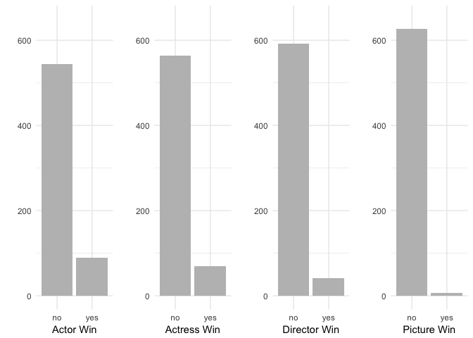

``` r
# Distribution of audience score for each category
p_actor <- ggplot(movies_ft, aes(x=best_actor_win, y=audience_score, fill=best_actor_win)) + geom_boxplot() + theme(legend.position="none") + ylim(0,100) + labs(x="Actor win", y="Audience score")
p_actress <- ggplot(movies_ft, aes(x=best_actress_win, y=audience_score, fill=best_actress_win)) + geom_boxplot() + theme(legend.position="none") + ylim(0,100) + labs(x="Actress win", y="Audience score") 
p_dir <- ggplot(movies_ft, aes(x=best_dir_win, y=audience_score, fill=best_dir_win)) + geom_boxplot() + theme(legend.position="none") + ylim(0,100) + labs(x="Director win", y="Audience score")
p_pic <- ggplot(movies_ft, aes(x=best_pic_win, y=audience_score, fill=best_pic_win)) + geom_boxplot() + theme(legend.position="none") + ylim(0,100) + labs(x="Picture win", y="Audience score")

grid.arrange(p_actor, p_actress, p_dir, p_pic, ncol=4)
```

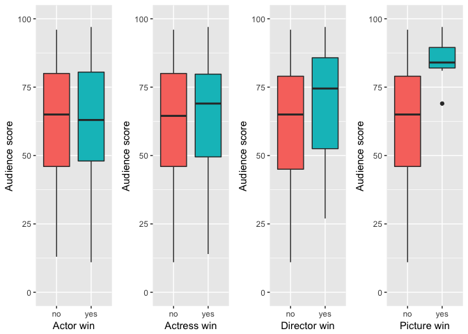

We can see that audience rating is not particularly related to whether or not the main actor/actress ever won an Oscar.

#### 7. Top 200 box office

``` r
# Distribution of top 200 box office
ggplot(movies_ft, aes(x=top200_box)) + geom_bar(fill=16, width=.5) + ylim(0,650) + labs(x="Top 200 Box Office") + theme_minimal()
```

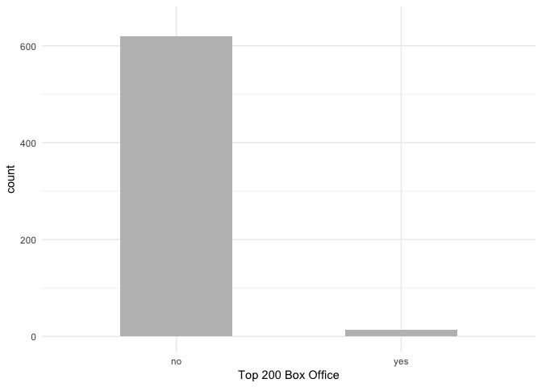

``` r
# Distribution of audience score depending on whether or not the movie was in the Top 200 Box Office list on BoxOfficeMojo
ggplot(movies_ft, aes(x=top200_box, y=audience_score, fill=top200_box)) + geom_boxplot() + labs(x="Top 200 box office", y="Audience score", fill="") + ylim(0,100) + labs(x="Top 200 box office", y="Audience score")
```


``` r
# "yes" to 1, "no" to 0
movies_ft <- movies_ft %>%
  transform(best_pic_win = ifelse(best_pic_win == "yes", 1, 0), best_actor_win = ifelse(best_actor_win == "yes", 1, 0), best_actress_win = ifelse(best_actress_win == "yes", 1, 0), best_dir_win = ifelse(best_dir_win == "yes", 1, 0), top200_box = ifelse(top200_box == "yes", 1, 0)) 
```

------------------------------------------------------------------------

Part 4: Modeling
----------------

In Part 3, we have already selected all potential explnatory variables for the multiple regression. Our stretegy is backward elimination with adjusted *R*<sup>2</sup>. Starting with the model including all potential predictors, eleminate a variable that leads to the largest improvement in adjusted *R*<sup>2</sup> from the model, and this step is repeated until we cannot impove adjusted *R*<sup>2</sup> furthure. Adjusted *R*<sup>2</sup> approach is chosen because our goal is to predict audience score more accurately for a new date rather than finding statistically significant predictors.

> backward elimination with adjusted *R*<sup>2</sup>

``` r
# Starting with the full model
summary(lm(audience_score ~ genre + runtime + mpaa_rating + tr_year + critics_score + best_pic_win + best_actor_win + best_actress_win + best_dir_win + top200_box, movies_ft))$adj.r.squared
```

    ## [1] 0.5256506

``` r
# Eliminating "mpaa_rating" variable
summary(lm(audience_score ~ genre + runtime + tr_year + critics_score + best_pic_win + best_actor_win + best_actress_win + best_dir_win + top200_box, movies_ft))$adj.r.squared
```

    ## [1] 0.528036

``` r
# Eliminating "best_dir_win" variable
summary(lm(audience_score ~ genre + runtime + tr_year + critics_score + best_pic_win + best_actor_win + best_actress_win + top200_box, movies_ft))$adj.r.squared
```

    ## [1] 0.5287533

``` r
# Eliminating "best_actor_win" variable
summary(lm(audience_score ~ genre + runtime + tr_year + critics_score + best_pic_win  + best_actress_win + top200_box, movies_ft))$adj.r.squared
```

    ## [1] 0.5292379

``` r
# Eliminating "top200_box" variable
summary(lm(audience_score ~ genre + runtime + tr_year + critics_score + best_pic_win  + best_actress_win, movies_ft))$adj.r.squared
```

    ## [1] 0.5293746

``` r
# Eliminating "best_pic_win" variable
summary(lm(audience_score ~ genre + runtime + tr_year + critics_score + best_actress_win, movies_ft))$adj.r.squared
```

    ## [1] 0.5294505

``` r
# Eliminating "best_actree_win" variable, we've got our final model which has only 4 predictors.
summary(lm(audience_score ~ genre + runtime + tr_year + critics_score, movies_ft))$adj.r.squared
```

    ## [1] 0.5296491

Our final model is called "predict\_model" and its adjusted *R*<sup>2</sup> is 0.5296.

``` r
predict_model <- lm(audience_score ~ genre + runtime + tr_year + critics_score, movies_ft)
summary(predict_model)
```

    ## 
    ## Call:
    ## lm(formula = audience_score ~ genre + runtime + tr_year + critics_score, 
    ##     data = movies_ft)
    ## 
    ## Residuals:
    ##     Min      1Q  Median      3Q     Max 
    ## -37.579  -8.695   0.275   9.820  40.203 
    ## 
    ## Coefficients:
    ##                                Estimate Std. Error t value Pr(>|t|)    
    ## (Intercept)                    28.42014    4.16407   6.825  2.1e-11 ***
    ## genreAnimation                  6.40379    4.97450   1.287 0.198463    
    ## genreArt House & International  6.10073    4.09540   1.490 0.136825    
    ## genreComedy                    -0.58270    2.28802  -0.255 0.799058    
    ## genreDocumentary                9.69509    2.83041   3.425 0.000655 ***
    ## genreDrama                      1.61527    1.96202   0.823 0.410672    
    ## genreHorror                    -7.41507    3.38952  -2.188 0.029069 *  
    ## genreMusical & Performing Arts 10.38040    4.43633   2.340 0.019608 *  
    ## genreMystery & Suspense        -3.82505    2.53526  -1.509 0.131876    
    ## genreScience Fiction & Fantasy -6.04662    4.93932  -1.224 0.221351    
    ## runtime                         0.06888    0.03070   2.243 0.025223 *  
    ## tr_year1980s                   -2.82242    2.46807  -1.144 0.253243    
    ## tr_year1990s                    0.23170    2.33635   0.099 0.921035    
    ## tr_year2000s                    0.78344    2.25309   0.348 0.728172    
    ## tr_year2010s                   -5.13580    2.47636  -2.074 0.038499 *  
    ## critics_score                   0.45689    0.02231  20.483  < 2e-16 ***
    ## ---
    ## Signif. codes:  0 '***' 0.001 '**' 0.01 '*' 0.05 '.' 0.1 ' ' 1
    ## 
    ## Residual standard error: 13.86 on 618 degrees of freedom
    ## Multiple R-squared:  0.5408, Adjusted R-squared:  0.5296 
    ## F-statistic: 48.52 on 15 and 618 DF,  p-value: < 2.2e-16

Let's take one example and see how the model coefficients work. If we have an animation movie released in 2010s whose runtime is 108 (min) and critics score 98 (%), then the predicted value of audience score for the movie is

28.42014 + 1 \* (6.40379)+108 \* (0.06888)+1 \* ( − 5.13580)+98 \* (0.45689)=81.90239.

> Model diagnostics

Check if our multiple regression model satisfies the following assumptions;

-   the residuals of the model are nearly normal,
-   the variability of the residuals is nearly constant,
-   the residuals are independent, and
-   each variable is linearly related to the outcome.

#### 1. Normal residual

The histogram of residuals looks pretty symmetric and the normal q-q plot is almost the straight line. These two plots support the fact that the distribution of residuals with respect to our regression model is almost normal.

``` r
hist(predict_model$residuals, breaks=20, ylim=range(0,100), xlab="Residuals", ylab="", main="Distribution of residuals", col="light blue") 
```

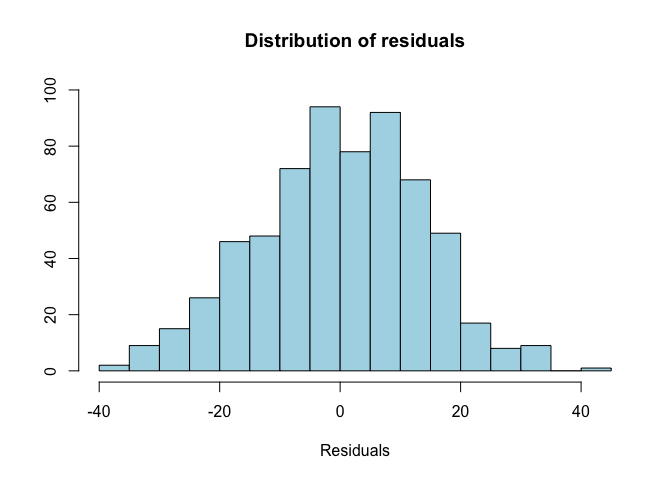

``` r
qqnorm(predict_model$residuals, xlim=range(-4, 4), main="Normal Q-Q plot of residuals", col="skyblue")
qqline(predict_model$residuals, col="darkblue")
```

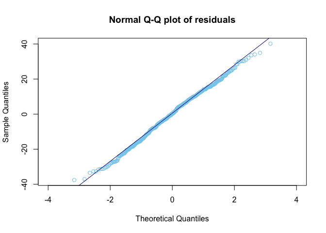

#### 2. Constant variability of residual

The second plot shows the absolute value of the residuals against their fitted values. We don't see any obvious deviation from constance variance.

``` r
plot(predict_model$residuals ~ predict_model$fitted, xlab = "Fitted Value", ylab = "Residual", cex = .6, col = "light green")
abline(0, 0)
```

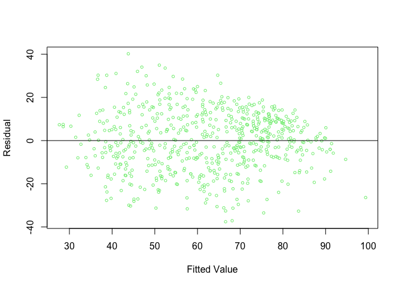

``` r
plot(abs(predict_model$residuals) ~ predict_model$fitted, xlab = "Fitted Value", ylab = "Absolute Value of Residual", cex = .6, col = "dark green")
```

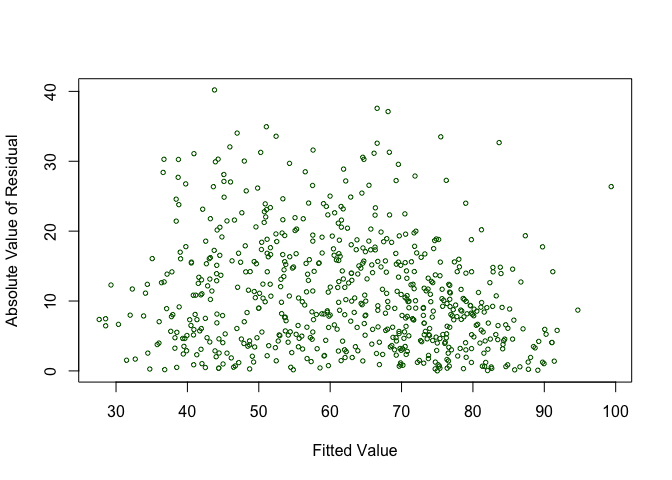

#### 3. Independent residual

This is a plot of residuals in order of their data collection. We don't see any specific pattern or construction here indicating that the residuals are independent.

``` r
plot(predict_model$residuals, xlab="Data Collecting Order", ylab="Residuals", cex=.6, col="orange")
abline(0,0, col="grey")
```

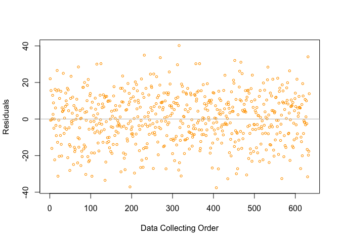

#### 4. Linearity between each predictor and outcome

The following four plots show the residuals against real values of each predictor. There are some fluctuations of the variability of the residuals across the different groups in each plot. In addition, we see some possible structures, which indicates that the relationships might not be linear.

``` r
# genre
plot(predict_model$residuals ~ factor(movies_ft$genre), xlab="Genre", ylab="Residuals", col="pink", names=c("Act","Ani","A.H.","Com","Doc","Dra","Hor","Mus","Mys","Sci"))
```

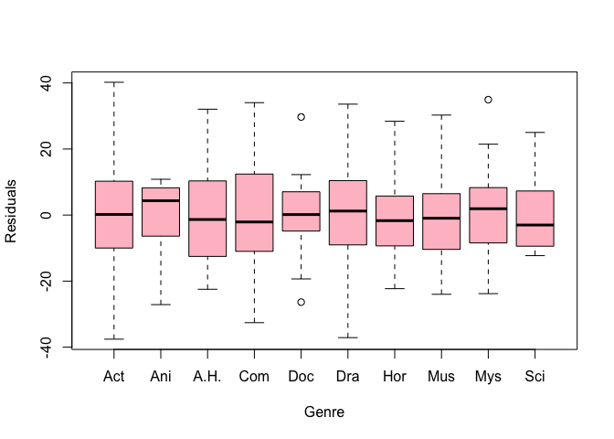

In the above plot of movies\_ft$genre vs. residuals, the full names of x-axis are "Action & Adventure", "Animation", "Art House & International", "Comedy", "Documentary", "Drama", "Horror", "Musical & Performing Arts", "Mystery & Suspense", and "Science Fiction & Fantasy" from left to right.

``` r
# runtime
plot(predict_model$residuals ~ movies_ft$runtime, xlab="Runtime", ylab="Residuals", cex=.6, col="hot pink")
abline(0,0, col="grey")
```

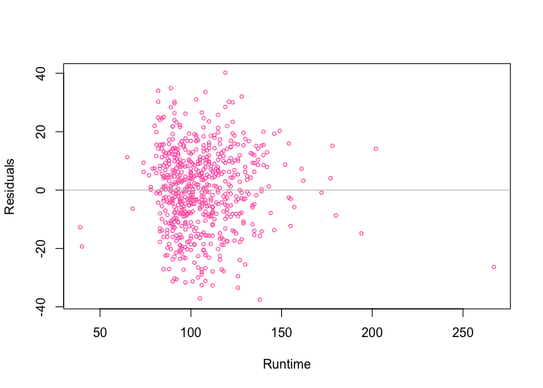

``` r
# theater release year
plot(predict_model$residuals ~ factor(movies_ft$tr_year), xlab = "Release Year", ylab = "Residuals", col = "light blue")
```

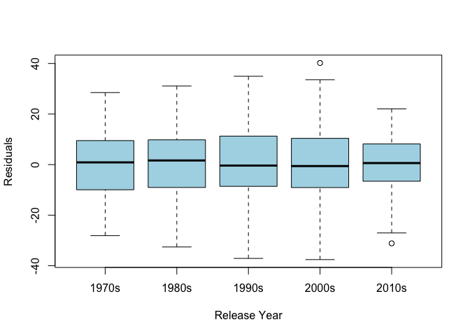

``` r
# critics score
plot(predict_model$residuals ~ movies_ft$critics_score, xlab = "Critics Score", ylab = "Residuals", cex = .6, col = "dark blue")
abline(0,0, col = "grey")
```

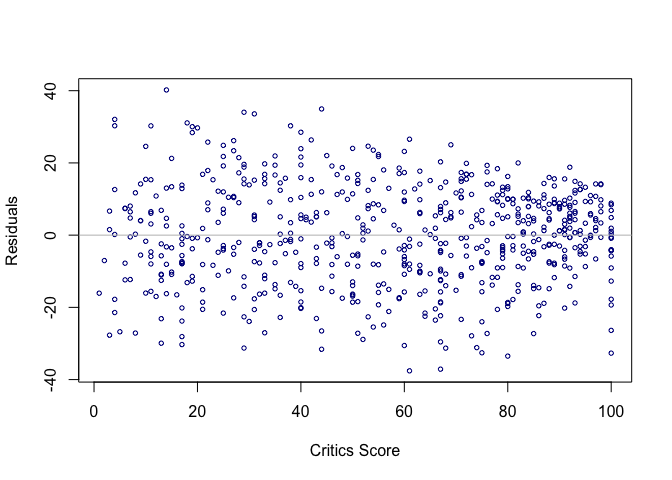

------------------------------------------------------------------------

Part 5: Prediction
------------------

``` r
# fitted values vs. data
ggplot(data = predict_model, aes(x = .fitted, y = movies_ft$audience_score)) +
  geom_point(cex=1) + geom_smooth(method = "lm", se = FALSE, col="red") + theme_minimal() + labs(x="Fitted Audience Score", y="Audience Score in Data", title="Fitted Scores vs. Data") + xlim(20,105) + ylim(10, 100)
```

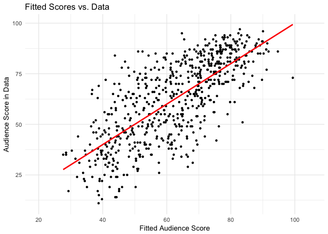

I picked four movies released in 2016. According to Rotten Tomatoes, audience scores of these movies are 94%, 56%, 92%, and 80%, respectively.

-   One more time with feeling
-   The witch
-   Zootopia
-   Moonlight

``` r
# Create a data frame each of whose rows contains information of a movie
# Source: Rotton Tomatoes
new_movies2016 <- data.frame("title"=c("One more time with feeling", "The witch", "Zootopia", "Moonlight"), "genre"=c("Documentary", "Horror", "Animation", "Drama"), "runtime"=c(112, 92, 108, 110), "tr_year"=c("2010s","2010s","2010s","2010s"), "critics_score"=c(100,91,98,98), "audience_score"=c(94, 56, 92, 80))
new_movies2016
```

    ##                        title       genre runtime tr_year critics_score
    ## 1 One more time with feeling Documentary     112   2010s           100
    ## 2                  The witch      Horror      92   2010s            91
    ## 3                   Zootopia   Animation     108   2010s            98
    ## 4                  Moonlight       Drama     110   2010s            98
    ##   audience_score
    ## 1             94
    ## 2             56
    ## 3             92
    ## 4             80

``` r
# Predict audience scores for the movies with a prediction interval
predict(predict_model, newdata=new_movies2016, interval="prediction")
```

    ##        fit      lwr       upr
    ## 1 86.38278 58.79724 113.96831
    ## 2 63.78303 35.81042  91.75565
    ## 3 81.90218 53.02552 110.77885
    ## 4 77.25142 49.83054 104.67230

A prediction interval is an estimate of an interval in which future observations will fall, with a certain probability (commonly 95%), given what has already been observed. As we can see, all our fitted values are in the prediction intervals. The minimum and maximum residuals (data - fitted value) are 80 − 77.25142 = 2.74858 and 92 − 81.90218 = 10.09782 in our new dataset.

------------------------------------------------------------------------

Part 6: Conclusion
------------------

Our research question was to find the best multiple regression model to predict an audience rating of a movie, i.e. its popularity in some sense. Our final regression model in Part 4 consists of 4 predictors which are genre, runtime, theater release year, and critics score. Actually, it was easy to guess that Critics score would be one of them. But I was surprised that runtime has a positive correlation with audience score and the distribution of the scores varies a lot accross the different genres. Also, it was interesting to observe that people are giving lower scores for recent movies released in 2010s than ones in previous years. (See the summary of the final model in Part 4.)

When examining the assumptions for the regression model in Part 4, we only checked them using plots. In my analysis, the plots look not too bad, but the linearity between each predictor and response variable is still hard to tell if it has no issue.
