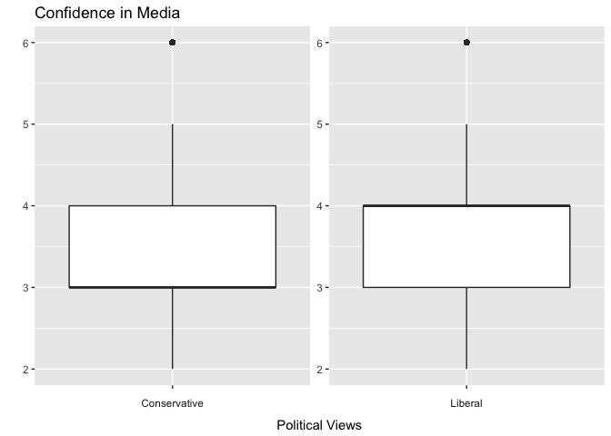

Statistical inference with the GSS data
================

Setup
-----

### Load packages

``` r
library(ggplot2)
library(dplyr)
library(statsr)
```

### Load data

``` r
load("gss.Rdata")
```

------------------------------------------------------------------------

Part 1: Data
------------

The General Social Surveys (GSS) have been conducted during 1972 through 2012. From 1972 to 2004, the targeted population was English-speaking adults aged 18 years or over, living in non-institutional arrangements within the United States, and starting in 2006, Spanish-speakers were added to the population. Since the sample was independently drawn from the population, our results can be generalized, but we should be careful about a targeted population changed since 2006. Since the study is observational and random assignment is not used, the findings cannot be used to establish causal relationships.

Source: <http://gss.norc.org/Documents/codebook/GSS_Codebook.pdf>

------------------------------------------------------------------------

Part 2: Research question
-------------------------

I have seen so many articles about the U.S. media's bias against Trump since last year, and no matter whether it is true or not, I have got an impression that how much Americans trust in media may depend on what their political preferences are. So my research question is, "Are the average levels of confidence in media different depending on the political views?"

------------------------------------------------------------------------

Part 3: Exploratory data analysis
---------------------------------

The variables that I am interested in are the following three, and filtering out the missing values, I make a new data set, "gss\_ft." In "gss\_ft," adding up the trust levels of television and press, we create a new variable "conmedia," ranged 2 to 6, whose value increases as the level of confidence in media goes up. The variable, "political\_views," has three types of political views, Liberal, Moderate, and Consevative.

``` r
gss %>%
  select(polviews, conpress, contv) %>%
  str()
```

    ## 'data.frame':    57061 obs. of  3 variables:
    ##  $ polviews: Factor w/ 7 levels "Extremely Liberal",..: NA NA NA NA NA NA NA NA NA NA ...
    ##  $ conpress: Factor w/ 3 levels "A Great Deal",..: NA NA NA NA NA NA NA NA NA NA ...
    ##  $ contv   : Factor w/ 3 levels "A Great Deal",..: NA NA NA NA NA NA NA NA NA NA ...

``` r
gss_ft <- gss %>%
  select(polviews, conpress, contv) %>%
  filter(!is.na(polviews), !is.na(conpress), !is.na(contv)) %>%
  transform(contv = 4-as.numeric(contv), conpress = 4-as.numeric(conpress)) %>%
  mutate(conmedia = conpress + contv) %>% 
  mutate(political_views = ifelse(as.numeric(polviews) < 4, "Liberal", ifelse(as.numeric(polviews) == 4, "Moderate", "Conservative")))
```

As you can see in the summary below, the average level of confidence in media is lowest in Conservative group and highest in Liberal group, and the difference between two means is about 0.289.

``` r
gss_ft %>%
  group_by(political_views) %>%
  summarise(count = n(), mean = round(mean(conmedia),3), median = median(conmedia), sd = round(sd(conmedia),3), IQR = IQR(conmedia)) %>%
  arrange(desc(-mean))
```

    ## # A tibble: 3 x 6
    ##   political_views count  mean median    sd   IQR
    ##             <chr> <int> <dbl>  <dbl> <dbl> <dbl>
    ## 1    Conservative 11557 3.470      3 1.099     1
    ## 2        Moderate 13121 3.712      4 1.066     1
    ## 3         Liberal  9261 3.759      4 1.087     1

``` r
gss_ft <- gss_ft %>%
  filter(political_views%in%c("Conservative","Liberal"))
```

``` r
ggplot(data = gss_ft, aes(x = political_views, y=conmedia)) + geom_boxplot() + facet_wrap(~political_views, scales='free', strip.position = "bottom") + labs(title = "Confidence in Media", x = "Political Views", y = "") + theme(axis.text.x = element_blank(), strip.background = element_blank(), strip.placement = "outside") 
```



The above box plots show that at least 50% of people for each group have trust levels 3 or 4 in media, and Conservative (or Liberal) group is densely distributed at level 3 (or 4, repsectively).

------------------------------------------------------------------------

Part 4: Inference
-----------------

As I stated in Part 2, I insist that the average levels of trust in media are not same for two groups, Conservative and Libreal. Letting *μ*<sub>*c*</sub> and *μ*<sub>*l*</sub> be the population means for Conservative and Liberal groups, respectively, the null hypothesis and the alternative hypothesis are  *H*<sub>0</sub>  :  *μ*<sub>*c*</sub> = *μ*<sub>*l*</sub>  and $\\ H\_A\\ :\\ \\mu\_c \\not= \\mu\_l\\ $. Our sampled observations are independent both within and between groups, and the numbers of observations for the two groups are 11557 and 9261 which are obviously less than 10% of their respective populations. Since our sample size is large enough, the skewness condition can be compromised. Based on the conditions we have just checked, we can use t-test to compare two independent means *μ*<sub>*c*</sub> and *μ*<sub>*l*</sub>. We will put a significance level *α* equal to 0.5.

``` r
P = gss_ft$political_views == "Conservative"
cmedia.csv <- gss_ft[P,]$conmedia
cmedia.lbr <- gss_ft[!P,]$conmedia
```

``` r
t.test(cmedia.lbr, cmedia.csv, alternative = "two.sided", mu = 0, paired = FALSE, var.equal = FALSE, conf.level = 0.95)
```

    ## 
    ##  Welch Two Sample t-test
    ## 
    ## data:  cmedia.lbr and cmedia.csv
    ## t = 18.936, df = 19928, p-value < 2.2e-16
    ## alternative hypothesis: true difference in means is not equal to 0
    ## 95 percent confidence interval:
    ##  0.2586912 0.3184302
    ## sample estimates:
    ## mean of x mean of y 
    ##  3.758665  3.470105

From the results of t-test, we have a very tiny p-value which is less than 2.2 \* 10<sup>−16</sup> and so obviously less than 0.5. Hence, by a hypothesis test with a significance level *α* = 0.5, we will reject the null hypothesis  *H*<sub>0</sub>  :  *μ*<sub>*c*</sub> = *μ*<sub>*l*</sub> . In addition, let $\\bar{x\_c}$ and $\\bar{x\_l}$ be sample means of the two groups. The 95% confidence interval of $\\ (\\bar{x\_l}-\\bar{x\_c})\\ $ is  (0.2586912,  0.3184302)  which does not include 0 in it. The results from two methods, a hypothesis test and a confidence interval, agree, and we can conclude that these data do indeed provide convincing evidence that there is a difference between the average levels of confidence in media for the Conservative and Liberal groups.

In our lecture, a degree of freedom for t statistic is calculated as the minimum of the sample sizes of the two samples, minus 1, when we estimate the difference between independent means. In our case, we would have  min(11557, 9261)−1 = 9260 . But, we can see in the above result from a built-in t-test in R that a degree of freedom was 19928. So I just wanted to check if we have the same result with the method given in lecture. Since a 95% confidence interval is  (0.2759287,  0.3011927)  and the interval does not contain the null value 0, the result agree with the previous ones.

``` r
mean_difference <- mean(cmedia.lbr)-mean(cmedia.csv)
df <- min(length(cmedia.csv)-1, length(cmedia.lbr)-1)
SE <- sqrt(sd(cmedia.csv)^2/length(cmedia.csv) + sd(cmedia.lbr)^2/length(cmedia.lbr))
pt <- pt(0.95, df) 
mean_difference - pt*SE
```

    ## [1] 0.2759287

``` r
mean_difference + pt*SE
```

    ## [1] 0.3011927
